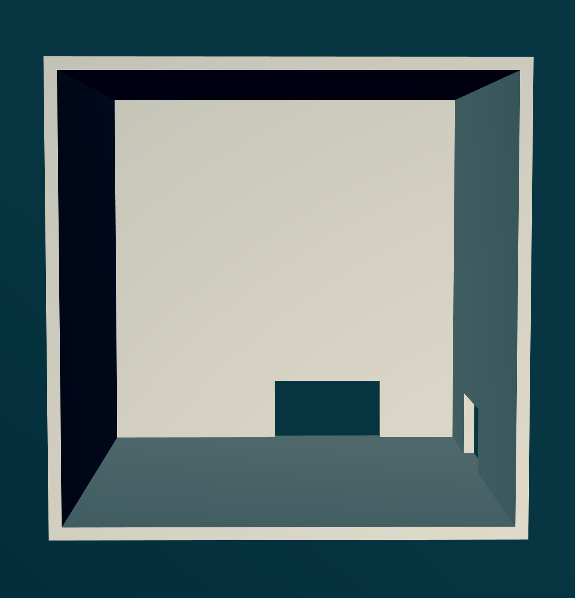
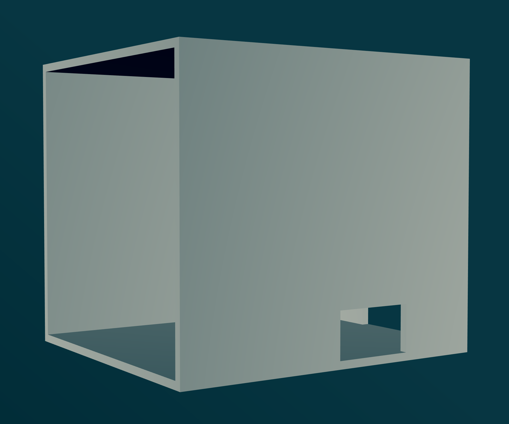
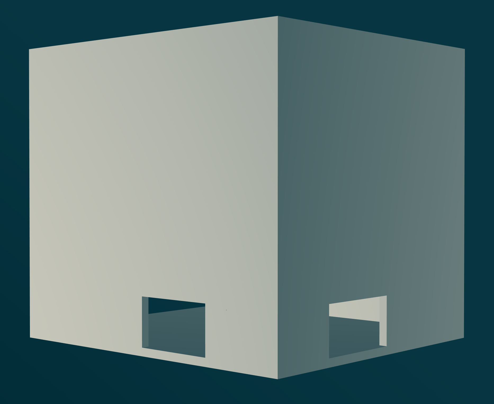

# Prusa Mini Enclosure

## About

An enclosure for my Prusa Mini. This is work in progress.

## Model

If you have libfive Studio available to you, check out the model in the `model/` directory. If you haven't, the file is still valuable, as it contains all the measurements as well as extensive documentation about how they were derived.

This is the front view of the enclosure. The big opening is where the door would go, and the right and back opening are visible from the inside:

This shows the view from the front-right corner. The right opening is visible from the outside:

View from the back-right corner. The back opening is visible from the outside:

## License

This project is open source, licensed under the terms of the [Zero Clause BSD License] (0BSD, for short). This basically means you can do anything with it, without any restrictions, but you can't hold the author liable for problems.

See [LICENSE.md] for all details.

[Zero Clause BSD License]: https://opensource.org/licenses/0BSD
[LICENSE.md]: https://github.com/hannobraun/prusa-mini-enclosure/blob/main/LICENSE.md
