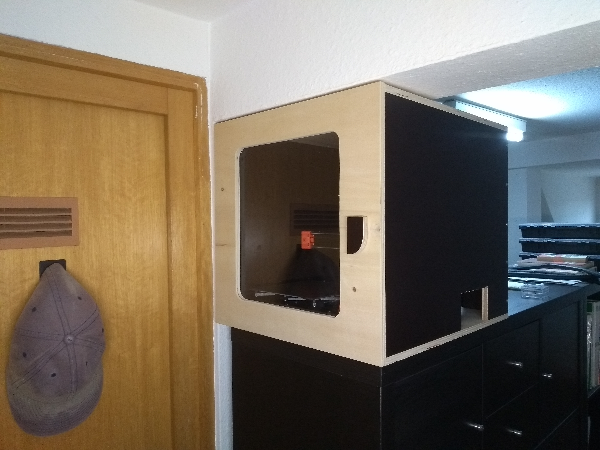
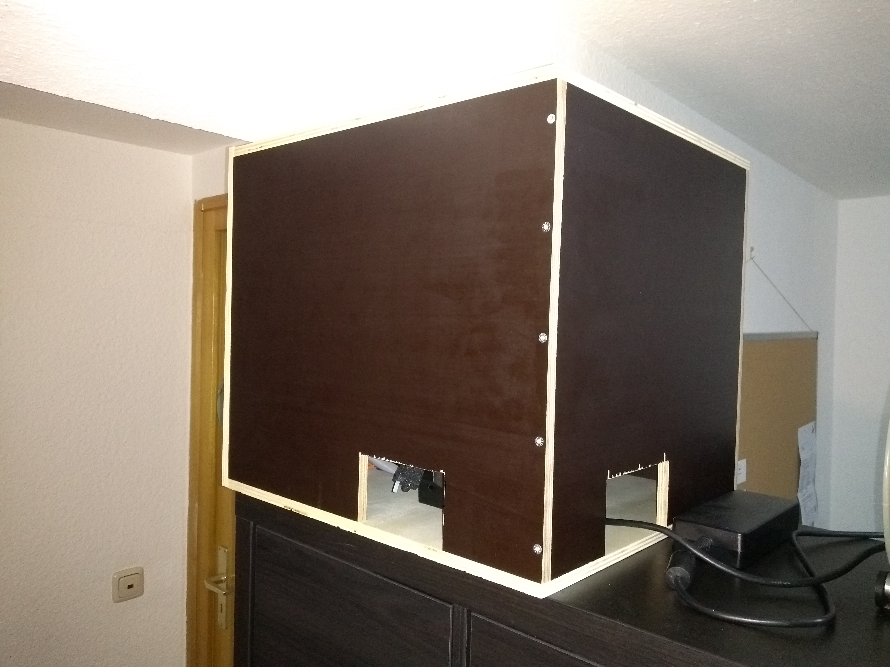
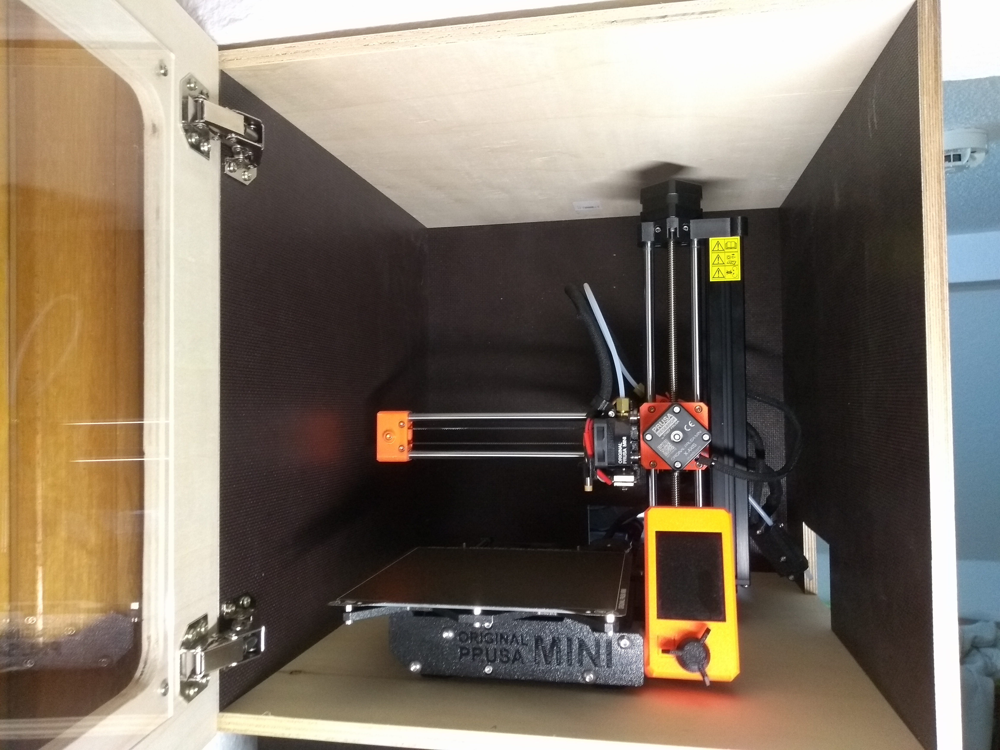
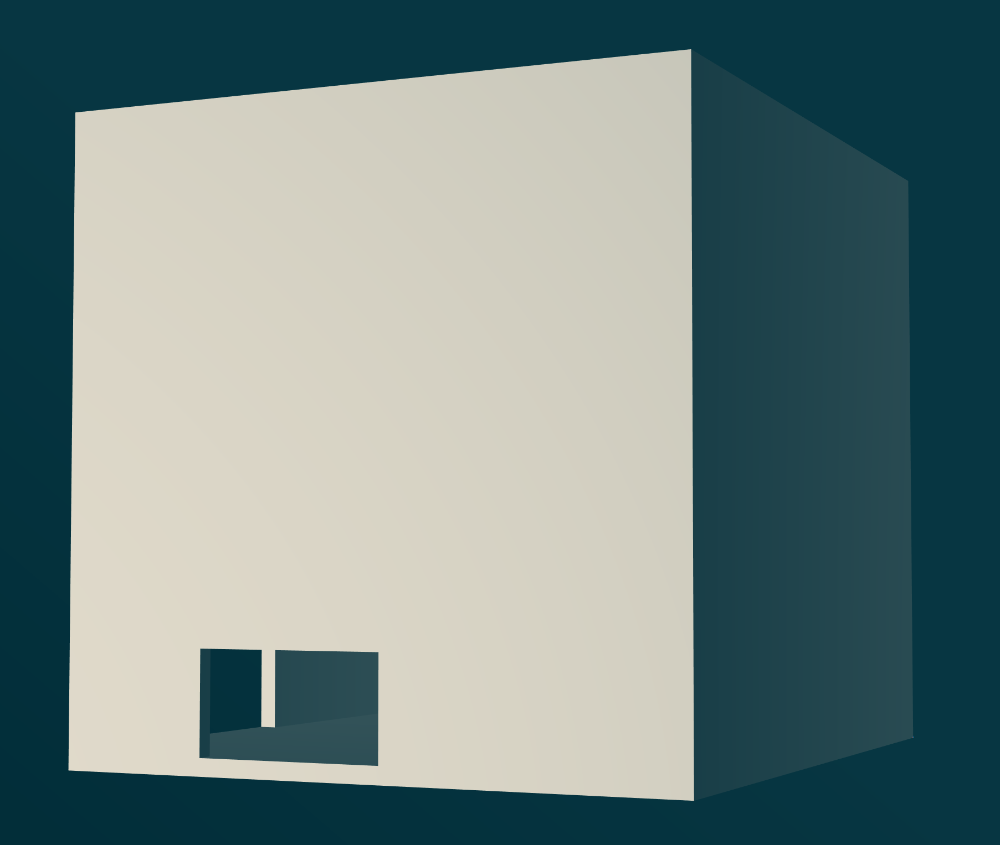

# Prusa Mini Enclosure

## About

This is an enclosure for my Prusa Mini. It was designed by me and built by my friend Martin Dederer.

Here's the view of the finished product from the front-right. You can see the door with the window, and the access port for the power switch, USB ports, and filament:

View from the back-right. Here you also see the back access port for power and network cables:

And finally, the front view with the door open and the printer inside:

This is only the first version. I plan to make some extensions and modifications:

- Make power switch and USB port accessible from the front, using extensions from levendig|dsgn ([[1]](https://shop.levendigdsgn.com/products/usb-powerswitch-extension-cable-prusa-mini), [[2]](https://shop.levendigdsgn.com/products/usb-powerswitch-extension-printed-parts-front-prusa-mini), [[3]](https://shop.levendigdsgn.com/collections/prusa-mini-mods-upgrades/products/usb-powerswitch-backplate-front-prusa-mini)).
- Print panels that fit over the access ports to further enclose the printer, with holes to let cables and filament through.
- Add lighting to the inside.

## Model

If you have libfive Studio available to you, check out the model in the `model/` directory. If you haven't, the file is still valuable, as it contains all the measurements as well as extensive documentation about how they were derived.

This is the front view of the enclosure. The big opening is where the door would go, and the back and right openings are visible from the inside:

This shows the view from the front-right corner. The right opening is visible from the outside:

View from the back-right corner. Both the back and right openings are visible from the outside:

View from the back-left corner. The back opening is visible from the outside:

## Drawings

For full information, check out the CAD model file, but here are some key drawings. All dimensions assume a material strength of 12mm.

Base and top are identical:

Left wall:

Right wall:

Back wall:

## License

This project is open source, licensed under the terms of the [Zero Clause BSD License] (0BSD, for short). This basically means you can do anything with it, without any restrictions, but you can't hold the author liable for problems.

See [LICENSE.md] for all details.

[Zero Clause BSD License]: https://opensource.org/licenses/0BSD
[LICENSE.md]: https://github.com/hannobraun/prusa-mini-enclosure/blob/main/LICENSE.md
