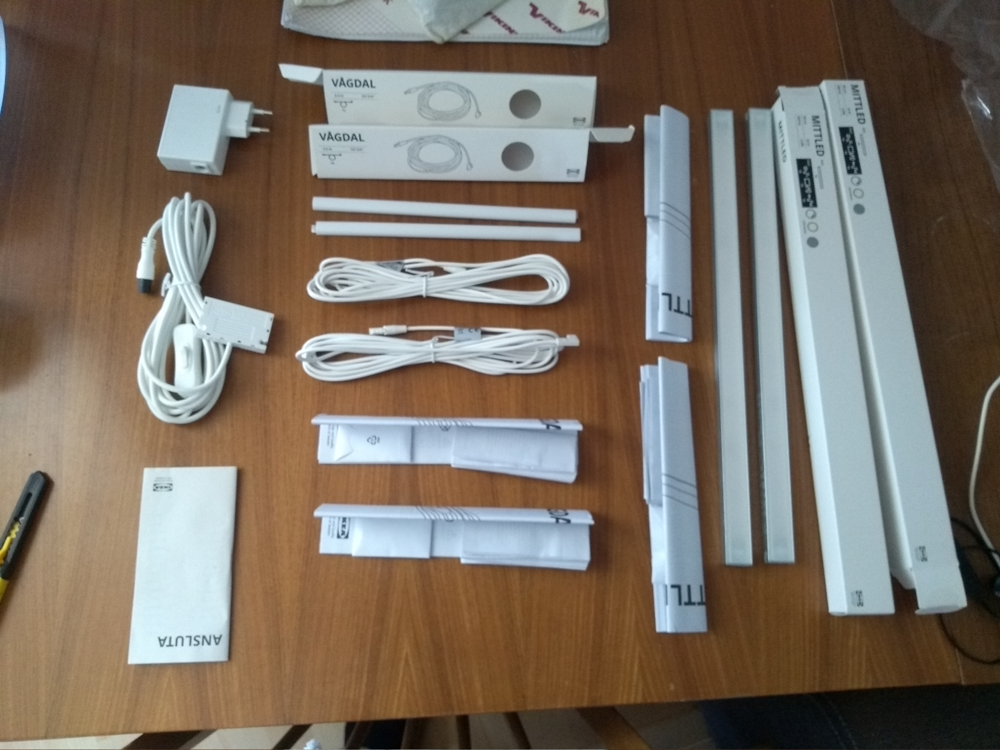
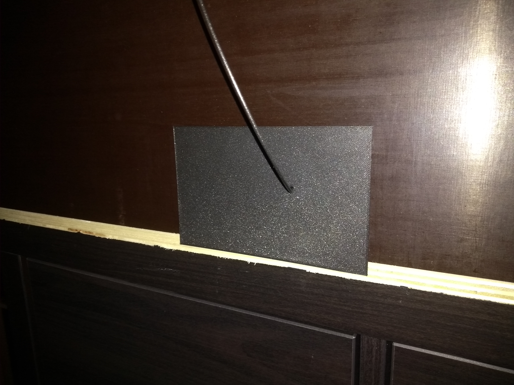
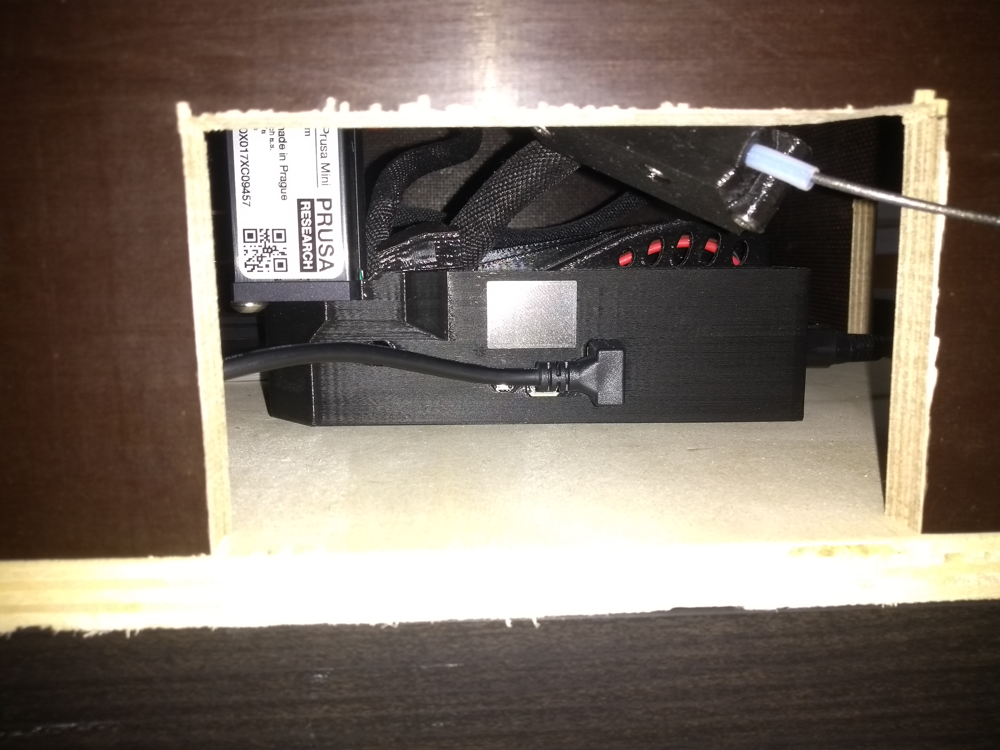

# Work Log

I have a daily habit of working on side projects. These projects used to be all software, and I made sure to make at least one useful commit every single day.

As I move more into physical projects, this doesn't work as well. But I do really like that daily commit as a way to track my habit, and I've decided I want to keep it. Hence this work log. Whenever I do work on this project that otherwise wouldn't result in a commit to this repository, I document it here.

## 2022-04-28

Unpacked and sorted through the lighting stuff I ordered (I decided to go with IKEA). Made a plan for how specifically to install it into the enclosure, but need to fetch some tools from the workshop before I can follow through.

## 2022-04-26

Printed and installed the cover for the side opening. Again, happy with how it turned out!

## 2022-04-25

Printed and installed the cover for the back opening. Very happy with how it turned out!

## 2022-01-27

Printed and installed a cover for the opening where the power switch formerly was located.

## 2022-01-25

- Installed [silicone sock](https://shop.levendigdsgn.com/products/silicone-sock-x-for-prusa-mini).
- Installed [USB and power switch extension cables](https://shop.levendigdsgn.com/collections/prusa-mini-mods-upgrades/products/usb-powerswitch-extension-cable-prusa-mini)
